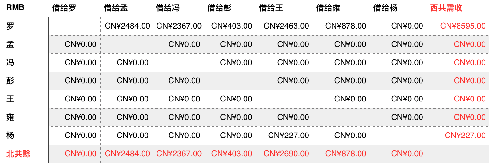

debtCalc
========

Calculate the debt relationship and show the optimized result.

Written in Python and MATLAB in Sydney and on an aircraft.

It's kinda a dirty implementation. If you want an app to share the bill, you may try [this](https://itunes.apple.com/cn/app/aa-ji-zhang-aa-zhi-lu-you/id541433906?mt=8).

Usage
-----
1. Export the day-to-day accounts from Excel/Numbers to "debtParse_input.txt".
2. Modify the "NumOfPeople" and "NameToNum" variables (and "Splitter" if necessary) in file "1debtParse.py".
3. Run "1debtParse.py" in Python, you'll get the output "debtParse_output_CNY.txt".
4. Modify the "NumOfPeople" variable in file "2debtCalc.m".
5. Run "2debtCalc.m" in MATLAB, you'll get the final result "debtCalc_FinalMatrix.txt".
6. An example of the meaning of the final matrix: 